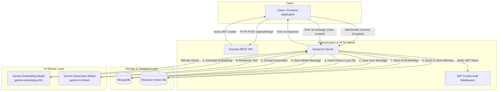

# ChatGPT Clone

> A real-time conversational AI backend engine powered by Node.js, Express, Socket.IO, Google Gemini 3.6 Flash, and Pinecone vector search for contextual memory storage.

## Overview

This repository implements a full-featured, real-time AI conversation backend service designed to replicate ChatGPT-style backend capabilities. Rather than relying on simple REST request-response cycles, the service establishes bi-directional WebSocket connections with JWT cookie-based authentication for instant message delivery and server-push streaming responses.

Every message sent through the system is transformed into vector embeddings via Google Gemini (`gemini-embedding-001`), indexed in Pinecone for semantic memory retrieval, and persisted in MongoDB for long-term session context. When generating responses, the backend combines indexed semantic memory with recent message history to provide context-aware responses from `gemini-3.6-flash`.

## Why I Built This

The goal of this project was to move beyond basic wrapper APIs and build a production-grade AI chat architecture from scratch. Key engineering objectives included:

- **Stateful Real-Time Messaging:** Utilizing Socket.IO with WebSocket handshake authentication via HTTP-only JWT cookies.
- **Vector Search & Memory Persistence:** Integrating Pinecone vector database to embed, store, and query conversation vectors per user and session.
- **Context-Aware Conversational AI:** Fetching both semantic vector matches and recent chat history from MongoDB to feed into Google Gemini's generative AI models.

## Key Features

- **Real-Time WebSocket Engine:** Socket.IO integration for continuous low-latency messaging.
- **Cookie & JWT Authentication:** Secure registration, login, and cookie-based JWT handshake verification for REST routes and WebSocket channels.
- **Vector Memory (Pinecone Integration):** Stores 768-dimensional embeddings generated by Gemini to facilitate semantic memory indexing and query filtering by user and chat ID.
- **Dual Storage Architecture:** Long-term message logging in MongoDB coupled with vector similarity indexing in Pinecone.
- **Google Gemini 3.6 Flash Integration:** Fast and intelligent conversational responses powered by the `@google/genai` SDK.
- **Contextual Session History:** Retains and appends structured role-based history (`user` and `model`) for coherent multi-turn chats.

## Architecture & Request Flow



## Tech Stack

- **Runtime & Server:** Node.js, Express 5 (`express`)
- **Real-Time Layer:** Socket.IO (`socket.io`)
- **Database:** MongoDB with Mongoose (`mongoose`)
- **Vector Database:** Pinecone (`@pinecone-database/pinecone`)
- **AI Models & SDK:** Google Generative AI (`@google/genai`)
  - Response Generation: `gemini-3.6-flash`
  - Vector Embeddings: `gemini-embedding-001` (768 dimensions)
- **Security & Authentication:** JSON Web Tokens (`jsonwebtoken`), `bcryptjs`, `cookie-parser`, `cookie`

## API & WebSocket Reference

### HTTP REST Endpoints

| Method | Endpoint | Description | Auth Required |
|---|---|---|---|
| `POST` | `/api/auth/register` | Register a new user (`fullName`, `email`, `password`) | No |
| `POST` | `/api/auth/login` | Authenticate user & set JWT cookie | No |
| `POST` | `/api/chat/` | Create a new chat session (`title`) | Yes (Cookie JWT) |

### Socket.IO Events

- **Handshake Connection:** Automatically parses `token` from client request cookies.
- **Client Event — `ai-message`:**
  ```json
  {
    "chat": "<chat_id>",
    "content": "What is vector search?"
  }
  ```
- **Server Response Event — `ai-response`:**
  ```json
  {
    "content": "Vector search is a methodology...",
    "chat": "<chat_id>"
  }
  ```

## Database Models

- **User Schema:** Manages user identity (`email`, `fullName.firstName`, `fullName.lastName`, hashed `password`).
- **Chat Schema:** Manages active chat threads (`user` reference, `title`, `lastActivity`).
- **Message Schema:** Stores chat turn details (`user`, `chat`, `content`, `role` enum: `['user', 'model', 'system']`).

## Environment Configuration

Create a `.env` file in the root directory with the following variables:

```env
PORT=3000
MONGODB_URL=mongodb://localhost:27017/chatgpt_clone
JWT_SECRET=your_jwt_secret_key
GEMINI_API_KEY=your_google_gemini_api_key
PINECONE_API_KEY=your_pinecone_api_key
```

## Getting Started

### Prerequisites

- Node.js (v18 or higher recommended)
- MongoDB instance (Local or Atlas)
- Pinecone Index configured (`chatgptclone`)
- Google Gemini API Key

### Installation

1. **Clone the repository:**
   ```bash
   git clone https://github.com/your-username/ChatGpt_Clone.git
   cd ChatGpt_Clone
   ```

2. **Install dependencies:**
   ```bash
   npm install
   ```

3. **Set up environment variables:**
   Create a `.env` file as described in the configuration section.

4. **Start the server:**
   ```bash
   npm start
   # or for development
   node server.js
   ```
