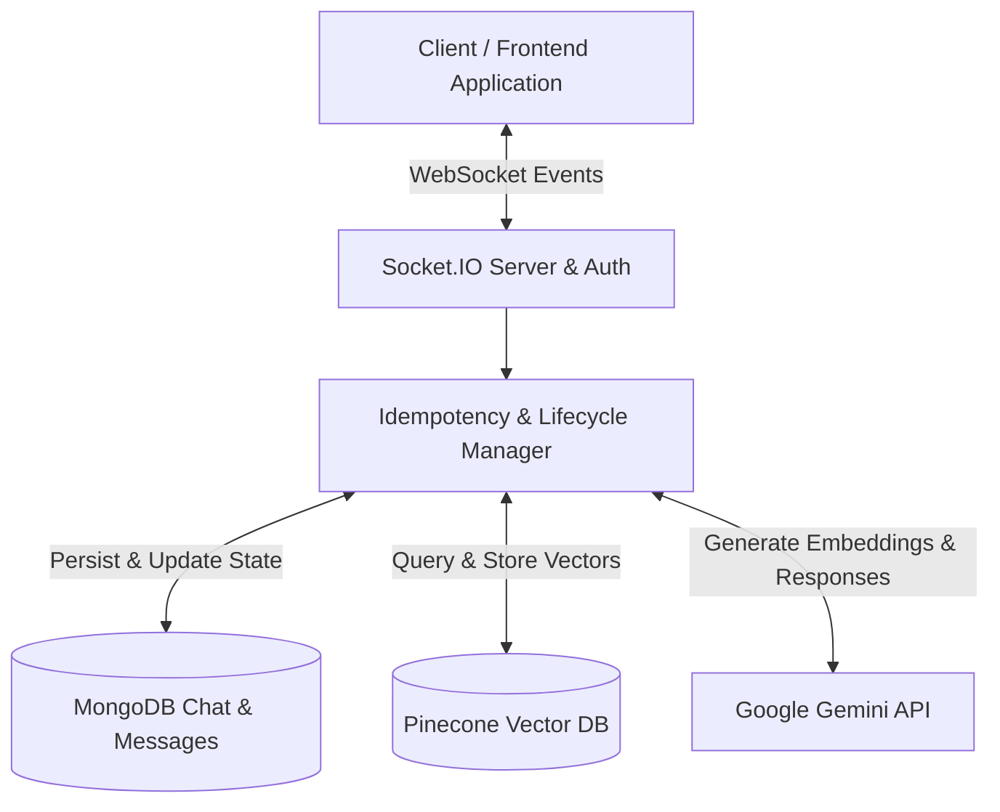

# ChatGPT Clone — Documentation Index

Welcome to the architectural and operational documentation for the Node.js AI Chat backend.

## Overview

This backend is a real-time conversational AI service built with **Node.js**, **Express**, **Socket.IO**, **MongoDB**, **Pinecone**, and **Google Gemini (`gemini-3.6-flash` & `gemini-embedding-001`)**.

It prioritizes:
- **Idempotent request processing** via unique client-supplied `requestId` keys.
- **Low-latency critical response path** through parallelized database & embedding calls.
- **Resilient request lifecycle tracking** with atomic compare-and-set stale recovery and retry mechanisms.
- **Long-term semantic memory retrieval & background processing** powered by Pinecone vector search and Google Gemini.

---

## Documentation Structure

### 🏗️ Architecture
- [Architecture Overview](file:///n:/Chatgpt_Clone/docs/architecture/overview.md) — Service topology, layer responsibilities, and end-to-end data flow.
- [Request Lifecycle](file:///n:/Chatgpt_Clone/docs/architecture/request-lifecycle.md) — State machine (`pending` → `completed` / `failed`), recovery transitions, and state timing.

### 🔄 Workflows & Concurrency
- [Request Idempotency](file:///n:/Chatgpt_Clone/docs/workflows/idempotency.md) — Two-layer idempotency (application-level lookup + MongoDB unique index), duplicate resolution, and race condition handling.
- [Stale Request Recovery](file:///n:/Chatgpt_Clone/docs/workflows/stale-request-recovery.md) — Detection timeout (`PENDING_REQUEST_TIMEOUT_MS`), compare-and-set atomic reclaiming, and existing message reuse.
- [Error Handling](file:///n:/Chatgpt_Clone/docs/workflows/error-handling.md) — Error categories, failure state recording, client error formatting, and non-blocking background error handling.

### 💾 Database
- [Database Schemas](file:///n:/Chatgpt_Clone/docs/database/schemas.md) — Data models (`User`, `Chat`, `Message`), role definitions, lifecycle fields, and known schema notes.
- [Database Indexes](file:///n:/Chatgpt_Clone/docs/database/indexes.md) — Unique partial index `{ chat: 1, requestId: 1 }` design, query filtering, and performance impact.

### 🎯 Architecture & Performance Decisions
- [Architecture Decision Records (ADRs)](file:///n:/Chatgpt_Clone/docs/decisions/architecture-decisions.md) — Key architectural choices (Socket.IO, requestId, background memory processing, etc.).
- [Performance Decisions](file:///n:/Chatgpt_Clone/docs/decisions/performance-decisions.md) — Parallel execution optimizations, query vector reuse, history limits, and atomic query benchmarks.
