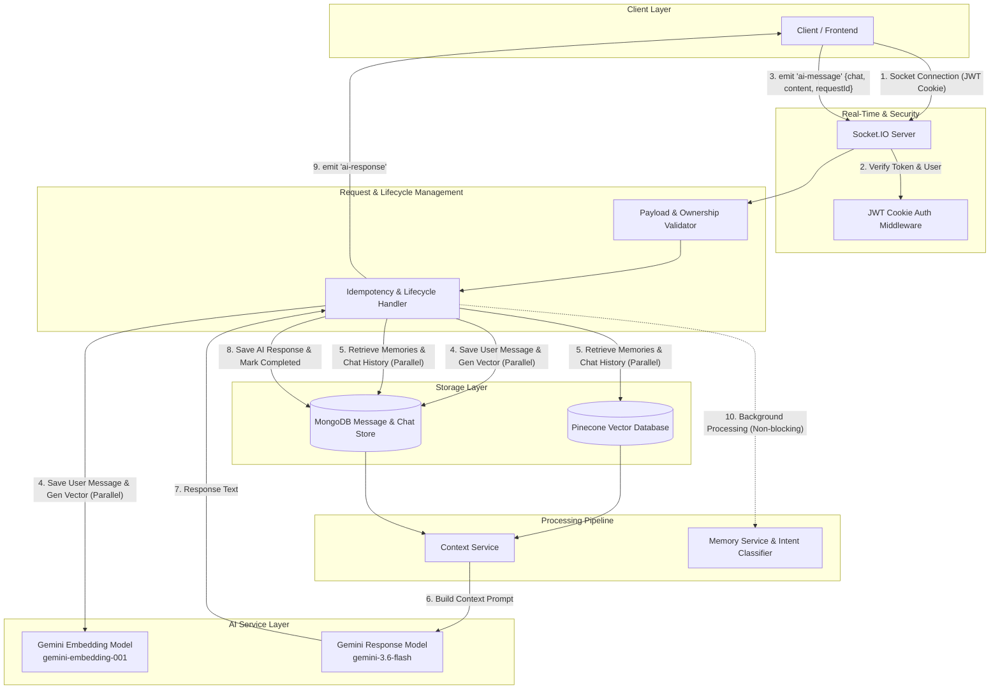

# Architecture Overview

This document describes the high-level system architecture, service responsibilities, and data flow of the Node.js AI Chat backend.

## High-Level Pipeline

---

## Service Responsibilities

### 1. HTTP Server & Socket.IO Server ([`server.js`](file:///n:/Chatgpt_Clone/server.js) & [`src/sockets/socket.server.js`](file:///n:/Chatgpt_Clone/src/sockets/socket.server.js))
- Initializes HTTP server and Socket.IO instance.
- Establishes connection handshakes and runs connection-level JWT cookie authentication.
- Listens for `ai-message` client events and routes them through validation, idempotency checks, response generation, and client emissions.

### 2. Authentication Middleware ([`src/middlewares/auth.middleware.js`](file:///n:/Chatgpt_Clone/src/middlewares/auth.middleware.js) & Socket Middleware)
- Verifies HTTP-only JWT cookies set during user login (`/api/auth/login`).
- Loads the corresponding MongoDB user record and attaches it to `socket.user`.
- Enforces user identity checks across all incoming WebSocket events.

### 3. Data Models ([`src/models/`](file:///n:/Chatgpt_Clone/src/models/))
- **`userModel`** (`user.model.js`): Manages user identity (`email`, `fullName`, `password`).
- **`chatModel`** (`chat.model.js`): Tracks chat sessions (`user`, `title`, `lastActivity`).
- **`messageModel`** (`message.model.js`): Persists messages (`chat`, `user`, `content`, `role`, `requestId`, `requestStatus`, `requestStartedAt`, `responseMessageId`). Includes a unique partial compound index on `{ chat: 1, requestId: 1 }`.

### 4. AI Service ([`src/services/ai.service.js`](file:///n:/Chatgpt_Clone/src/services/ai.service.js))
- Wraps the `@google/genai` SDK.
- `generateVector(content)`: Generates 768-dimensional text embeddings using `gemini-embedding-001`.
- `generateResponse(content)`: Generates chat responses using `gemini-3.6-flash` configured with system instructions from `HELPER_SYSTEM_INSTRUCTION`.

### 5. Vector Service ([`src/services/vector.service.js`](file:///n:/Chatgpt_Clone/src/services/vector.service.js))
- Interacts with Pinecone vector database index `chatgptclone`.
- Performs vector similarity queries (`findSimilarMemories`) scoped by `user` ID and `status: 'active'`.
- Upserts and updates memory records and statuses (`active` → `superseded`).

### 6. Retrieval Service ([`src/services/retrieval.service.js`](file:///n:/Chatgpt_Clone/src/services/retrieval.service.js))
- Ranks candidate memories retrieved from Pinecone by combining cosine similarity score, importance, confidence, recency decay (30-day half-life), and query intent type matching (`calculateRetrievalScore`).
- Reuses pre-computed query vectors passed from the critical path to avoid duplicate embedding calls.

### 7. Context Service ([`src/services/context.service.js`](file:///n:/Chatgpt_Clone/src/services/context.service.js))
- Combines top-ranked long-term memories (up to 5 active memories), recent chronological chat history (up to 20 messages), and current user input into a single structured prompt payload for Gemini.

### 8. Memory Service ([`src/services/memory.service.js`](file:///n:/Chatgpt_Clone/src/services/memory.service.js))
- Runs in the background **after** response emission.
- Extracts key facts/preferences/goals from user messages and AI responses via Gemini.
- Compares new candidate memories against existing Pinecone vectors to decide whether to create, ignore, or supersede old memories (`judgeMemory`).
