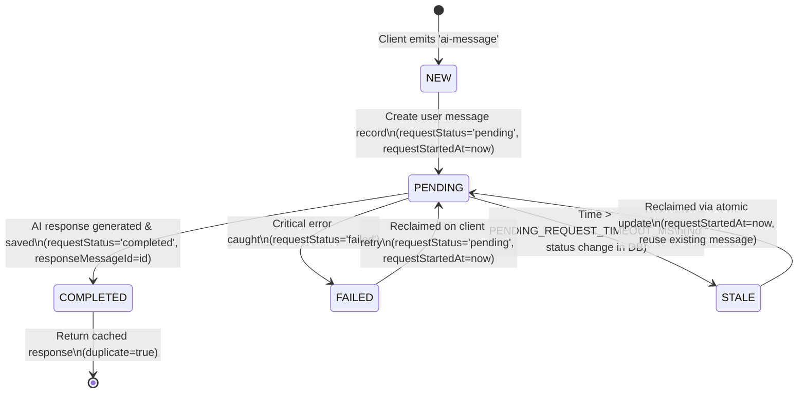

# Request Lifecycle & State Machine

This document details the lifecycle of an AI request, its state machine transitions, and how stale/failed requests are reclaimed.

## Overview & State Machine

Every AI interaction is identified by a client-provided `requestId` string (max 100 characters). The compound key `(chat, requestId)` identifies one unique logical request.



---

## Detailed Request Flow Steps

### 1. Payload & Authorization Validation
- Client emits `ai-message` payload containing `{ chat, content, requestId }`.
- System validates parameter types, non-empty strings, maximum lengths (`requestId` ≤ 100, `content` ≤ 10,000), and MongoDB ObjectId format for `chat`.
- System queries `chatModel` to ensure the target chat exists and belongs to `socket.user._id`.

### 2. Application-Level Idempotency Lookup
- System queries `messageModel` for an existing record matching `{ chat, requestId, role: 'user' }`.

| Existing State | Condition | Action |
|---|---|---|
| **Not Found** | New request | Proceed to parallel Step 3 (Message creation + Embedding). |
| **`completed`** | Duplicate completed request | Query `responseMessageId`, emit cached response with `duplicate: true`. |
| **`pending`** | `Date.now() - requestStartedAt <= PENDING_REQUEST_TIMEOUT_MS` | Emit `{ status: 'processing', messageId }`. Do not generate duplicate AI response. |
| **`pending`** | `Date.now() - requestStartedAt > PENDING_REQUEST_TIMEOUT_MS` | Stale request detected. Attempt atomic compare-and-set reclaim. Set `reuseExistingMessage = true`. |
| **`failed`** | Retry attempt | Atomic update `failed → pending`. Set `requestStartedAt = now` and `reuseExistingMessage = true`. |

### 3. Step 1: User Message Persistence & Embedding Generation (Parallel)
- **New Request (`reuseExistingMessage === false`)**:
  - `messageModel.create(...)` with `requestStatus: 'pending'` and `requestStartedAt: new Date()`.
  - `aiService.generateVector(content)` for query embedding.
  - Operations run concurrently via `Promise.all`.
  - **Concurrency Safety Net**: If two parallel sockets attempt `messageModel.create()` for the same `(chat, requestId)`, MongoDB throws an `E11000` duplicate key error. The `catch (error)` block recovers cleanly (see [Idempotency Workflow](file:///n:/Chatgpt_Clone/docs/workflows/idempotency.md)).
- **Reused Request (`reuseExistingMessage === true`)**:
  - Reuses the existing `messageModel` record. Does **not** call `messageModel.create()`.
  - Calls `aiService.generateVector(content)` to obtain the query embedding.

### 4. Step 2: Memory & Chat History Retrieval (Parallel)
- Concurrent `Promise.all`:
  - `retrieveMemories({ query: content, queryVector, userId: socket.user._id, limit: 5 })`: Uses Pinecone vector search and intent classification ranking. Reuses `queryVector` generated in Step 1.
  - `messageModel.find({ chat }).sort({ createdAt: -1 }).limit(20)`: Retrieves latest 20 messages for context, reversed into chronological order.

### 5. Step 3 & 4: Context Building & AI Generation
- `buildContext()` formats active memories and recent chat history.
- `aiService.generateResponse(context.contents)` queries Gemini (`gemini-3.6-flash`).

### 6. Step 5: Response Persistence & Completion
- `messageModel.create(...)` creates the model response document (`role: 'model'`).
- `messageModel.updateOne({ _id: message._id, requestId }, { $set: { requestStatus: 'completed', responseMessageId: responseMessage._id } })`.
- Emits `ai-response` payload `{ content, chat, messageId, requestId }` to client socket.

### 7. Step 6: Background Memory Processing
- Invokes `processMemories(...)` asynchronously (`.then()/.catch()`). Non-blocking fire-and-forget execution.

---

## Timeout Configuration & Safety Relationship

```javascript
const PENDING_REQUEST_TIMEOUT_MS = process.env.PENDING_REQUEST_TIMEOUT_MS
  ? parseInt(process.env.PENDING_REQUEST_TIMEOUT_MS, 10)
  : 60 * 1000; // 60 seconds (default)
```

> [!IMPORTANT]
> **Timeout Hierarchy & Safety Margin**
> - **External AI Timeout (`45 seconds`)**: `ai.service.js` enforces a bounded 45-second timeout on Google Gemini API calls (`generateResponse` & `generateVector`).
> - **Stale Request Recovery Timeout (`60 seconds`)**: `socket.server.js` sets the stale recovery threshold to **60 seconds** (`PENDING_REQUEST_TIMEOUT_MS`).
> - **Safety Relationship**: The stale recovery threshold (60s) is strictly greater than the maximum AI API timeout (45s). This prevents race conditions where an in-flight AI call is prematurely reclaimed while still generating a response.

