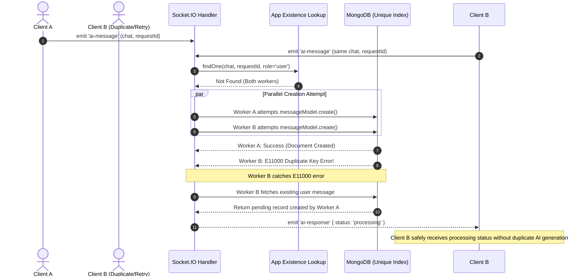

# Request Idempotency Workflow

This document explains the two-layer idempotency architecture designed to ensure safe, duplicate-free request processing under high concurrency, retries, and network reconnection events.

## Guarantee Boundaries: Database Idempotency vs. AI Execution

> [!IMPORTANT]
> **Understanding Idempotency Guarantees**
> - **Database Idempotency (Guaranteed)**: The unique compound MongoDB index on `{ chat: 1, requestId: 1 }` guarantees that multiple persisted user message records cannot be created for the same logical `requestId` within a chat.
> - **Application Level Lookup**: In normal operation, duplicate requests for completed IDs return previously saved responses without calling Gemini.
> - **External AI Service Execution**: If an external AI API call fails mid-flight or a worker crashes after calling Gemini but before updating MongoDB to `completed`, reclaiming the request will trigger a retry AI call. The system does **not** use distributed locking or multi-document transactions across external APIs.

---

## Why Idempotency Protection is Required

Clients operating over real-time WebSockets or mobile networks may re-send the exact same logical request due to:
- Double clicks on the UI
- Automatic Socket.IO reconnection retries
- Temporary network dropouts and browser retries
- Client-side timeout retries

Without idempotency, duplicate requests create multiple user message records in MongoDB and trigger unnecessary AI model generations.

The logical idempotency key is the compound pair: `(chat, requestId)`.

---

## Two-Layer Idempotency Protection



### Layer 1: Application-Level Pre-Lookup
Before inserting a new message, `socket.server.js` performs an explicit lookup:
```javascript
const existingRequest = await messageModel
  .findOne({
    chat,
    requestId: normalizedRequestId,
    role: 'user',
  })
  .select('_id content requestId requestStatus requestStartedAt responseMessageId')
  .lean();
```

- **`completed`**: Fetches the stored model response by `responseMessageId` and returns it immediately with `duplicate: true`.
- **Fresh `pending`**: Returns `{ status: 'processing' }` immediately.
- **Stale `pending` / `failed`**: Reclaims the request record and sets `reuseExistingMessage = true`.

### Layer 2: Database-Level Unique Compound Index
Application-level checks alone are subject to race conditions when two identical requests arrive within milliseconds of each other (before either record is written).

To guarantee database integrity, MongoDB enforces a unique partial index on `messageModel`:
```javascript
messageSchema.index(
  { chat: 1, requestId: 1 },
  {
    unique: true,
    partialFilterExpression: {
      requestId: { $type: 'string' },
    },
  },
);
```

When concurrent workers attempt `messageModel.create()`, MongoDB allows exactly one write to succeed. The losing worker receives error code `11000` (`E11000 duplicate key error`).

---

## Expected E11000 Catch Handler Flow

The `E11000` duplicate key exception is an expected concurrency signal in this architecture when parallel requests bypass the pre-lookup stage.

When an `E11000` exception is caught:

1. System queries MongoDB for the existing user message created by the winning worker.
2. Inspects `existingMessage.requestStatus`:
   - **`pending`**: Emits `{ status: 'processing', messageId: existingMessage._id }`.
   - **`completed`**: Reads `responseMessageId` and emits the cached AI response with `duplicate: true`.
   - **`failed`**: Atomically updates `failed → pending` via `updateOne({ _id: existingMessage._id, requestStatus: 'failed' })`. If successful, sets `message = existingMessage` and continues into Step 2 processing using the existing record.
