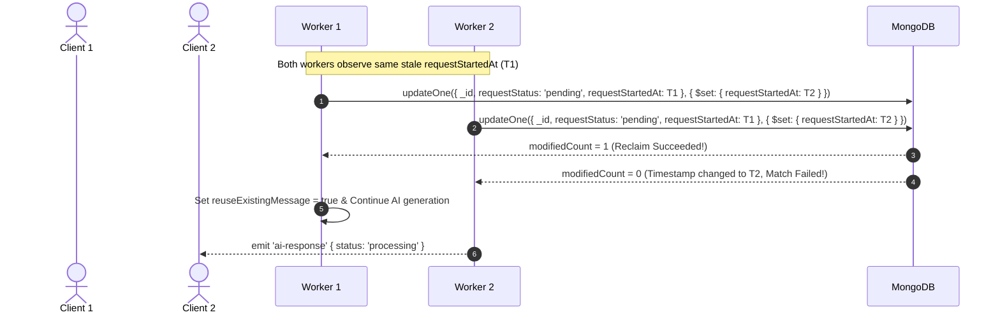

# Stale Request Recovery Workflow

This document explains how the system detects and reclaims stale pending requests safely under concurrency without creating duplicate database records or triggering duplicate AI responses.

## Causes of Stale Requests

A request enters a `pending` state when a user message is saved to MongoDB. A pending request can become **stale** if:
- The Node.js server process crashes or restarts during AI generation.
- The client socket disconnects unexpectedly while processing.
- Downstream service calls hang indefinitely.

When this occurs, MongoDB retains a record with `requestStatus: 'pending'`, but no active worker process is handling it.

---

## Stale Detection Mechanism

During the application-level idempotency lookup, the system evaluates the age of the pending request:

```javascript
const PENDING_REQUEST_TIMEOUT_MS = 10 * 1000; // 10 seconds (testing configuration)

const startedAt = existingRequest.requestStartedAt
  ? new Date(existingRequest.requestStartedAt).getTime()
  : null;

const isStale = !startedAt || Date.now() - startedAt > PENDING_REQUEST_TIMEOUT_MS;
```

- **If `isStale === false`**: The request is actively being processed by another worker. The socket emits `{ status: 'processing' }` and exits.
- **If `isStale === true`**: The request is considered abandoned and eligible for atomic compare-and-set reclamation.

---

## Compare-and-Set Atomic Reclamation

To prevent two concurrent clients/sockets from reclaiming the same stale request simultaneously, the system uses a compare-and-set query filter matching `_id`, `requestStatus`, and the **exact observed `requestStartedAt` timestamp**:



### Reclamation Code Implementation

```javascript
const staleRecovery = await messageModel.updateOne(
  {
    _id: existingRequest._id,
    requestStatus: 'pending',
    requestStartedAt: existingRequest.requestStartedAt,
  },
  {
    $set: {
      requestStartedAt: new Date(),
    },
  },
);

if (staleRecovery.modifiedCount !== 1) {
  // Another worker already reclaimed this stale request
  return socket.emit('ai-response', {
    chat,
    requestId: normalizedRequestId,
    status: 'processing',
    messageId: existingRequest._id,
  });
}

// Successfully reclaimed — reuse existing user message instead of creating a duplicate
reuseExistingMessage = true;
```

---

## Reusing Existing Messages

Setting `reuseExistingMessage = true` is critical:
1. Prevents Step 1 from calling `messageModel.create()`.
2. Avoids MongoDB `E11000 duplicate key error` on `{ chat, requestId }`.
3. Assigns `message = existingRequest` and continues directly to query vector generation, context retrieval, and AI generation.
